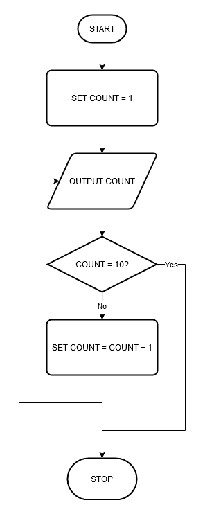

# Flowcharts

I was working through flowcharts with a student yesterday. I asked her to create a flowchart for an algorithm to count to 10. Here is what she produced:



That works for me. But then we tried to convert it into ERL or Python. That didn't work out so well. We found we either had to create coding horrors or redraw the diagram. For example, in ERL:

```erl
count = 1
done = False // we need this to break the loop
do
    print(count)
    if count == 10 then
        done = True
    else
        count = count + 1
    endif
until done
```

(Aside: does anyone else find it odd that the OCR specification for ERL defines a `DO WHILE loop` as `do ... until ...`?)

We could get closer in Python (but it's a bit nasty):

```python
count = 1
while True:
    print (count)
    if count == 10: break # exit from the middle, eek!
    count = count + 1
pass
```

Whereas, what we'd want to get to is something more like this in ERL:

```erl
for count = 1 to 10
    print(count)
next count
```

Or this in Python:

```python
for count in range(10):
    print (count + 1)
```

The `+1` will probably seem odd here, but is this more or less confusing than `range(1, 11)`:

```python
for count in range(1, 11):
    print (count)
```

Or worse:

```python
numbers = [i + 1 for i in range(10)]
for count in numbers:
    print (count)
```

It seems to me that flowcharts as we have them are a much better fit for conversion to assembly language or languages supporting `goto` statements such as QBasic:

```qbasic
    COUNT = 1
loop:
    PRINT COUNT
    IF COUNT = 10 THEN GOTO end
    COUNT = COUNT + 1
    GOTO loop
end:
    END
```

How are you handling the transition from a flowchart design into code: do you introduce extra restrictions for your flowcharts so they naturally translate into your structured programming language; or, do you kludge something together in your language to get it working and then suggest a tidy up?
